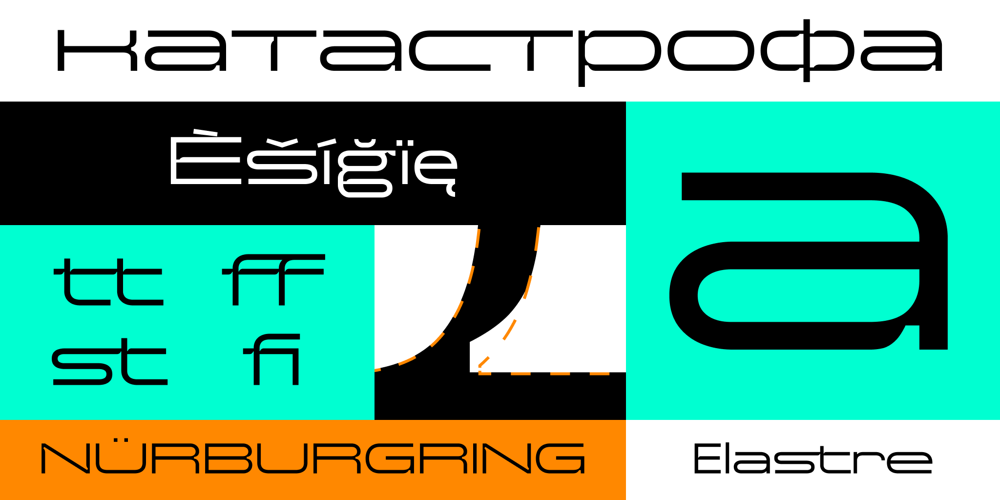

# Elastre Typeface
Elastre is a modern-looking typeface, it draws inspiration from the early 2000s and the chaotic energy of electronics, evoking the futuristic designs and vibrant colors of advertisements from that era. Its unique blend of blocky and curvy elements creates a versatile aesthetic, perfect for making bold statements or adding subtle, gentle touches to your text with `wdth` and `INKT` variable axis. It doesn’t confine you — it pushes you forward, encouraging you to break free from limitations. With Elastre typeface, you can *streeeetch* the boundaries of creativity without hesitation, exploring every corner of the galaxy. Elastre has got you covered, no matter how far you aim to go.

## Variable Font Axes

Axis | Tag | Range | Default 
--- | --- | --- | --- | ---
Inktrap | INKT | 0 to 100 | 0 
Hyper Expansion | HEXP | 0 to 100 | 0 

## Building Elastre

1. At the root of your local clone `cd path/to/local/clone`, create a virtual environment: `python3 -m venv myenv`.
2. Activate the virtual environment: `source myenv/bin/activate`.
3. Install gftools (or the requirements) in the virtual environment: `pip install gftools` or `pip install -r requirements.txt`.
4. Navigate to the `sources` directory and from the terminal, run: `gftools builder config.yaml`.
5. Done! You will find the fonts in the `fonts` directory.

## Additional information
### Designer

* Valeriy Egorov

### License

Copyright (c) 2025, Valeriy Egorov (valeriy.hfmn@gmail.com)
Licensed under the [*SIL Open Font License, 1.1*](http://scripts.sil.org/OFL); you may not use this file except in compliance with the License.

