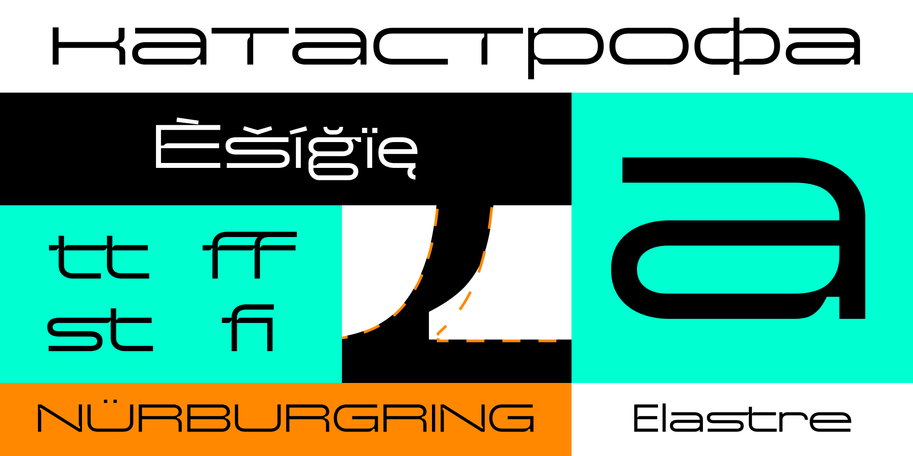
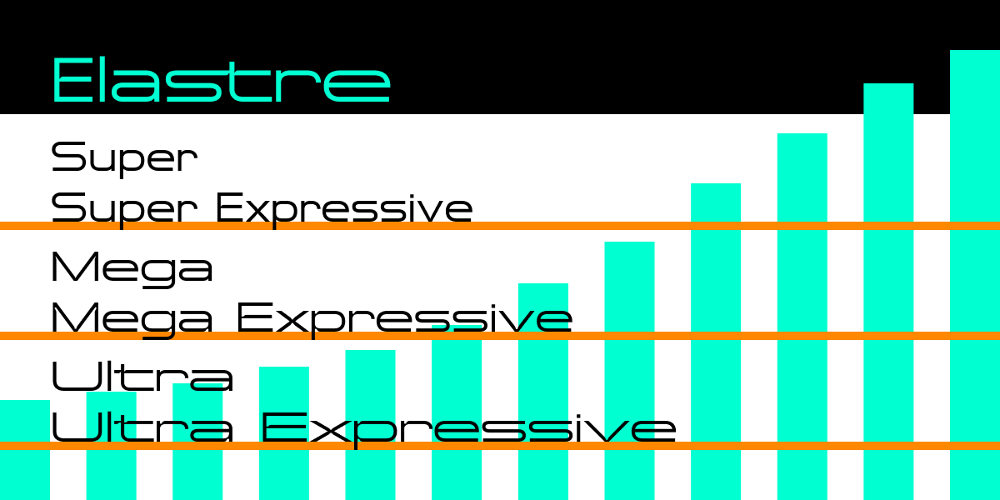

# Elastre Typeface
Elastre is a display typeface inspired by the early 2000s and the chaotic energy of imagining the future. It channels the futuristic design and dynamic nature of that era. It blends blocky and curvy elements into a versatile typeface, perfect for bold statements or expressive details. With Elastre typeface, you can *streeeetch* the boundaries of creativity and explore every corner of the galaxy — no matter how far you aim to go.

### Scripts
* Latin
* Cyrillic

## Building Elastre
To build the typeface follow these steps:
1. At the root of your local clone `cd path/to/local/clone`, create a virtual environment: `python3 -m venv myenv`.
2. Activate the virtual environment: `source myenv/bin/activate`.
3. Install gftools (or the requirements) in the virtual environment: `pip install gftools` or `pip install -r requirements.txt`.
4. Navigate to the `sources` directory and from the terminal, run: `gftools builder config.yaml`.
5. Done! You will find the fonts in the `fonts` directory.

## Additional information

### License
Copyright (c) 2025, Valeriy Egorov (valeriy.hfmn@gmail.com).
This Font Software is licensed under the SIL Open Font License, Version 1.1. This license is in this repo OFL.txt and is also available with a FAQ at: [*SIL Open Font License, 1.1*](http://scripts.sil.org/OFL).

